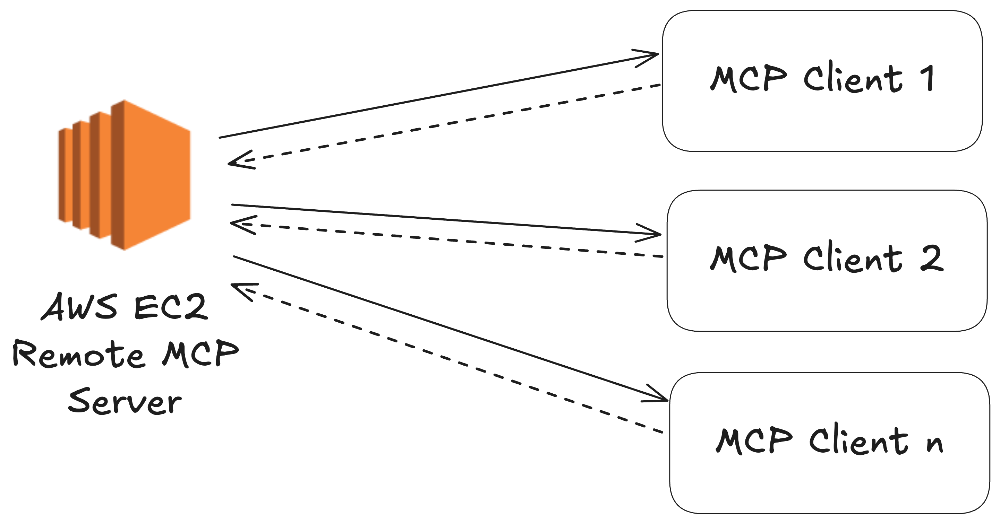

# Build and deploy remote MCP servers to AWS EC2

Learn how to build and deploy MCP servers to AWS EC2, making them available for remote usage.

[Blog post with step-by-step solution](https://tadeodonegana.com/posts/deploy-mcp-server-remote-aws/).